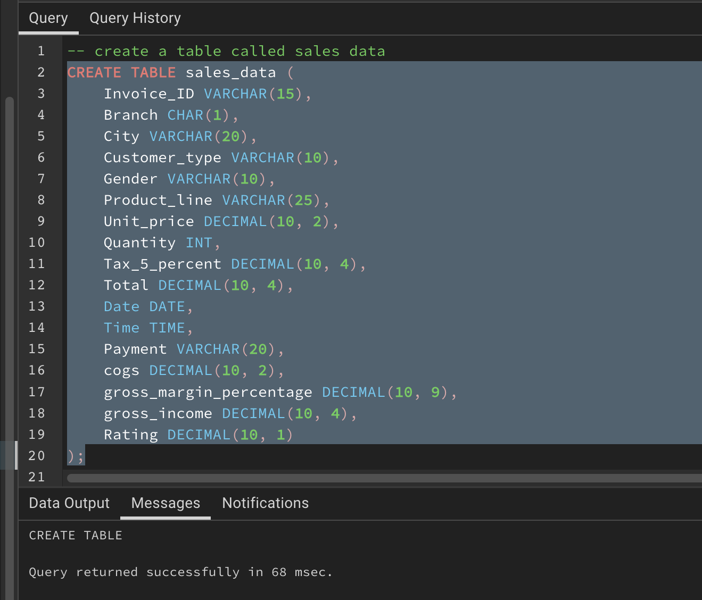

# Sales Performance Insights-Analyzing-Revenue-COGS-Payment-Trends-and-Customer-Impact
This repository name reflects a comprehensive approach to analyzing sales performance and insights. It covers multiple aspects of sales data, including revenue, cost of goods sold (COGS), payment trends, and the impact of different customer types.

## Introduction
The retail sales dataset was provided and can be seen under the name **supermarket_sales - project 2.csv** in the file section and I performed data analysis using SQL. The dataset contains information about various sales transactions, including product details, customer information, payment methods, and more.

## Problem Statement
The Company wanted to find a way to Optimizing Sales Performance and Customer Insights. They wanted to have a better understanding of sales patterns, customer preferences, and product performance which is crucial for making informed business decisions as it can unlock valuable insights to improve revenue generation, enhance customer experiences, and refine operational strategies.
The following questions were asked and the answers were provided to business problems below.
1. How many invoices are there in the dataset?
2. What is the total quantity of products sold?
3. What is the average unit price of products sold?
4. What is the total gross income?
5. What is the highest unit price among the products?
6. What is the lowest unit price among the products?
7. What is the average gross margin percentage?
8. What is the total gross margin percentage for each customer type?
9. What is the total tax amount for each branch?
10. What is the average rating for each product line?
11. What is the total revenue for each product line, considering both unit price and quantity?
12. What is the average quantity sold for each branch?
13. For each gender, what is the total gross income and total tax amount?
14. What is the average unit price and average quantity sold for each product line?
15. What is the total gross income for each payment method and customer type combination?
16. The total revenue for each gender
17. What is the total cost of goods sold (COGS) for each product line?
18. Which product lines have the highest and lowest average gross margin percentage?
19. What was the most used mode of payment?
20. Which customer type contributes the most to total revenue

## Data Analysis
The csv file was provided and the table inside the file has a dataset containing the following columns:
- Invoice ID
- Branch
- City
- Customer type
- Gender
- Product line
- Unit price
- Quantity
- Tax 5%
- Total
- Date
- Time
- Payment
- COGS (Cost of Goods Sold)
- Gross margin percentage
- Gross income
- Rating

The first step I took was to create a database called Sales. After creating the Sales Database, the next step was creating a table I named sales_data.
The Sales_data table contained the following columns with the appropriate data types.
- Invoice ID
- Branch
- City
- Customer type
- Gender
- Product line
- Unit price
- Quantity
- Tax 5%
- Total
- Date
- Time
- Payment
- COGS (Cost of Goods Sold)
- Gross margin percentage
- Gross income
- Rating

The table was successfully created as seen above with the returned message.

The next step was to import the .csv file into the table to put rows and values into our table created. There are two ways to import files into the table in PostgreSQL.
1. Import the files by right-clicking on the table name on the right-hand side and then selecting Import/Export data and then selecting the location/folder where your .csv file is located and then importing.
2. Writing up a code or query in the query tool. The code to write is
   COPY table_name

   FROM 'file-path/location of file'

   DELIMITER ','

   CSV HEADER;
So in this case, for me to upload my file, it would be 

   COPY sales_data

   FROM '/Users/jamesthomas/Desktop/SQL FILES AND DOCUMENTS/SQL ASSIGNMENT WITH SPLENDOR  /files/supermarket_sales - project 2.csv'

   DELIMITER ','

   CSV HEADER;
   
the file is now uploaded into the table in PostgreSQL.

