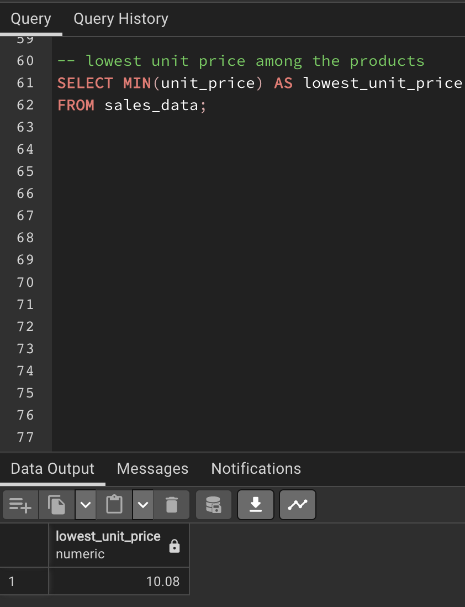

# Sales Performance Insights-Analyzing-Revenue-COGS-Payment-Trends-and-Customer-Impact
This repository name reflects a comprehensive approach to analyzing sales performance and insights. It covers multiple aspects of sales data, including revenue, cost of goods sold (COGS), payment trends, and the impact of different customer types.

## Introduction
The retail sales dataset was provided and can be seen under the name **supermarket_sales - project 2.csv** in the file section and I performed data analysis using SQL. The dataset contains information about various sales transactions, including product details, customer information, payment methods, and more.

## Problem Statement
The Company wanted to find a way to Optimizing Sales Performance and Customer Insights. They wanted to have a better understanding of sales patterns, customer preferences, and product performance which is crucial for making informed business decisions as it can unlock valuable insights to improve revenue generation, enhance customer experiences, and refine operational strategies.
The following questions were asked and the answers were provided to business problems below.
1. How many invoices are there in the dataset?
2. What is the total quantity of products sold?
3. What is the average unit price of products sold?
4. What is the total gross income?
5. What is the highest unit price among the products?
6. What is the lowest unit price among the products?
7. What is the average gross margin percentage?
8. What is the total gross margin percentage for each customer type?
9. What is the total tax amount for each branch?
10. What is the average rating for each product line?
11. What is the total revenue for each product line, considering both unit price and quantity?
12. What is the average quantity sold for each branch?
13. For each gender, what is the total gross income and total tax amount?
14. What is the average unit price and average quantity sold for each product line?
15. What is the total gross income for each payment method and customer type combination?
16. The total revenue for each gender
17. What is the total cost of goods sold (COGS) for each product line?
18. Which product lines have the highest and lowest average gross margin percentage?
19. What was the most used mode of payment?
20. Which customer type contributes the most to total revenue?

## Data Analysis
The csv file was provided and the table inside the file has a dataset containing the following columns:
- Invoice ID
- Branch
- City
- Customer type
- Gender
- Product line
- Unit price
- Quantity
- Tax 5%
- Total
- Date
- Time
- Payment
- COGS (Cost of Goods Sold)
- Gross margin percentage
- Gross income
- Rating

The first step I took was to create a database called Sales. After creating the Sales Database, the next step was creating a table I named sales_data.
The Sales_data table contained the following columns with the appropriate data types.
- Invoice ID
- Branch
- City
- Customer type
- Gender
- Product line
- Unit price
- Quantity
- Tax 5%
- Total
- Date
- Time
- Payment
- COGS (Cost of Goods Sold)
- Gross margin percentage
- Gross income
- Rating

The table was successfully created as seen above with the returned message.

Then you have to check to verify if your table was created and it was created.

The next step was to import the .csv file into the table to put rows and values into our table created. There are two ways to import files into the table in PostgreSQL.
1. Import the files by right-clicking on the table name on the right-hand side and then selecting Import/Export data and then selecting the location/folder where your .csv file is located and then importing.
2. Writing up a code or query in the query tool. The code to write is
   
   COPY table_name

   FROM 'file-path/location of file'

   DELIMITER ','

   CSV HEADER;
   
So in this case, for me to upload my file, it would be 

   COPY sales_data

   FROM '/Users/jamesthomas/Desktop/SQL FILES AND DOCUMENTS/SQL ASSIGNMENT WITH SPLENDOR  /files/supermarket_sales - project 2.csv'

   DELIMITER ','

   CSV HEADER;

   
   
the file is now uploaded into the table in PostgreSQL.

After the uploading was done, the next step was to check if your table had values by running the query SELECT * FROM sales_data which they did

Now, we had our full table to work with, we decided to answer and solve the business problems.

For problem 1, How many invoices are there in the dataset?
The query returns the total count of rows in the "sales_data" table, which corresponds to the number of invoices in the dataset.
We had 1000 different invoices in the dataset.

2. What is the total quantity of products sold?
The query calculates the sum of the "Quantity" column in the "sales_data" table, providing the total quantity of products sold across all invoices.
We had 5510 total products sold

3. What is the average unit price of products sold?
The query calculates the average unit price by computing the average of the "Unit price" column in the "sales_data" table.
The average unit price of products sold was 55.6721300000000000.
This value represents the average price at which individual units of various products were sold in the supermarket. In other words, it's the average amount customers paid for each unit of a product at the store.

4. What is the total gross income?
The query calculates the total gross income by summing up the "gross income" column in the "sales_data" table. The "gross income" is the amount after deducting the 5% tax from the total price.
The total gross income was 15379.3690.  it's the total revenue generated before deducting any costs or expenses. Overall revenue generated by the retail supermarket from the sales transactions 

6. What is the highest unit price among the products?
The query retrieves the maximum value from the "Unit price" column in the "sales_data" table, indicating the highest unit price among all products.
The highest unit price was 99.96. This value represents the highest price at which a single unit of a product was sold. It could have been a premium or luxury item that commands a higher price due to its quality, brand, or unique features.

                                                                          

7. What is the lowest unit price among the products?
The query retrieves the minimum value from the "Unit price" column in the "sales_data" table, indicating the lowest unit price among all products.
The lowest price was 10.08. This represents the lowest price at which a single unit of a product was sold. This could be a budget-friendly or entry-level item that is accessible to a wide range of customers due to its affordability.

                                              

9. What is the average gross margin percentage?
The query calculates the average of the "gross margin percentage" column in the "sales_data" table. The gross margin percentage represents the profit margin for each product.
The percentage was 4.761904762%. This is a financial metric that shows the proportion of revenue that exceeds the cost of goods sold (COGS), indicating how efficiently a company manages its production costs.

9. What is the total gross margin percentage for each customer type?
The query groups the data by "Customer type" and calculates the total gross margin percentage for each group. This provides insight into how profitable different customer types are.
Normal customers might represent occasional shoppers, while Members could be loyal or frequent buyers with potential benefits.

                                                                                 

10. What is the total tax amount for each branch?
The query groups the data by "Branch" and calculates the total tax amount (5% of the price) for each branch. This helps understand the tax revenue generated from each branch.
Branch "C" has the highest total tax amount of 5265.1765, followed closely by branch A with a total tax amount of 5057.1605. Branch B has the lowest total tax amount of 5057.032. The higher tax amount in branches C and A could be due to either higher sales revenue or a higher tax rate on products sold compared to branch B.

                                                                                   

11. What is the average rating for each product line?
The query groups the data by "Product line" and calculates the average rating for each product line. This gives insight into the average customer satisfaction for each product category. Higher average ratings might indicate that customers are more satisfied with products in certain categories, suggesting stronger market preferences. Higher ratings can suggest that customers perceive products in that category to be of better quality or value. Lower ratings could indicate that certain product lines are not meeting customer expectations or needs.

                                                                                    

12. What is the total revenue for each product line, considering both unit price and quantity?
The query groups the data by "Product line" and calculates the total revenue for each product line. Revenue is calculated by multiplying the "Unit price" and "Quantity" for each product sold. Higher total revenue suggests that certain product lines are more popular and have higher sales volumes. While revenue is a top-line metric, it's important to consider profitability as well. A high-revenue product line might not always translate to high profits if the associated costs are high. Products with higher total revenue might indicate higher demand from customers. Differences in total revenue can highlight seasonal trends and consumer buying patterns for different product lines.

                                                                     

13. What is the average quantity sold for each branch?
The query groups the data by "Branch" and calculates the average quantity sold for each branch. This provides insights into the sales performance of each branch. A higher average quantity indicates higher sales volume at that branch. Higher sales volume might indicate higher customer traffic in that branch. Branches with higher average quantity sold likely have a higher demand for products. Branches with higher average quantity sold might benefit from more effective marketing strategies. The average quantity sold could reflect the popularity of certain products among customers at specific branches.

                                                                      

14. For each gender, what is the total gross income and total tax amount?
The query groups the data by "Gender" and calculates the total gross income and total tax amount for each gender. This helps understand the revenue generated from each gender group. Differences in total gross income could indicate varying preferences in product categories or types of items purchased by each gender. Variations in the total tax amount might suggest differences in tax rates or sales distribution among gender categories. This might reflect the effectiveness of marketing strategies targeted at specific gender groups.

                                                                      

15. What is the average unit price and average quantity sold for each product line?
The query groups the data by "Product line" and calculates the average unit price and average quantity sold for each product line. This provides insights into pricing and sales volume for each product category. The average quantity sold reflects the popularity or demand for each product line category.

                                                            

                                                      

16. What is the total gross income for each payment method and customer type combination?
The query groups the data by both "Payment" and "Customer type" and calculates the total gross income for each combination. This shows the revenue generated based on different payment methods and customer types. The gross income from Member customer types might reflect benefits offered to members, such as discounts or exclusive offers. Certain payment methods may be associated with faster transaction processing, leading to higher gross income.

                                                          

17. The total revenue for each gender
The data can provide insights into spending behaviour and preferences based on gender. Analyzing revenue by gender can help identify which product lines or categories are more popular among different genders.
Females tend to bring in more revenue than males.

                                                              

18. What is the total cost of goods sold (COGS) for each product line?
By comparing the total COGS for different product lines, we can identify which product lines have higher or lower costs. Understanding COGS helps in assessing the profitability of each product line based on the difference between total revenue and COGS. Provides insights into which product lines are more cost-effective and contribute more to the gross profit.

                                                                

19. Which product lines have the highest and lowest average gross margin percentage?

20. What was the most used mode of payment?
The data shows the distribution of payment methods (Ewallet, Cash, Credit card) and the corresponding counts of each payment method in transactions. The data reveals which payment methods are more frequently used by customers for their purchases.  Payment preferences may differ based on customer segments (e.g., age, location). This data can be used to segment customers accordingly.

                                                                         

22. Which customer type contributes the most to total revenue?

## Some recommendations to the management
- Customize promotions and offers based on customer preferences and demographics.
- Understand and adapt to regional payment and shopping preferences based on city demographics.
- Gather and analyze customer feedback on payment methods, product lines, and overall shopping experience. Incorporate feedback into decision-making processes for continuous improvement
- Regularly maintain and update payment infrastructure to prevent technical issues during transactions. Invest in technology that enhances the payment experience, such as contactless payment options.
- Adjust pricing or sourcing strategies if margins fall below acceptable levels.
- Regularly review pricing trends and competitor offerings to stay competitive.
- Tailor marketing efforts to maximize customer engagement during peak shopping hours.
- Implement improvements or adjustments in underperforming branches to enhance customer experiences like creating attractive displays that highlight promotions, new arrivals, and popular items, encourage staff to engage with customers, offer assistance, and provide personalized recommendations, and stock products that resonate with the local culture, trends, and preferences.
- Implement a feedback mechanism, such as suggestion boxes or online surveys, to gather customer opinions. Actively listen to customer feedback and address concerns to show commitment to improvement.

## Conclusion
In delving into the depths of our retail sales dataset, I have found invaluable insights that explain customer preferences, revenue trends, and operational methods. By employing rigorous data analysis techniques, we've gained clarity on pricing dynamics, payment preferences, and temporal patterns. These revelations empower us to tailor strategies that optimize profitability, enhance customer experiences, and steer the business toward sustained growth. With these insights, we're poised to make informed decisions that align with market demands and capitalize on emerging opportunities.

The Company has 1000 invoices in its databases. The company sold 5,510 products at an average price of 55.672130000000000. They generated an income of 15,379.3690. The most expensive and priciest product cost 99.96 while the lowest priced product cost 10.08.
The Customers that were members or who had membership had a slight gross margin percentage of 2385.714285762 as against the normal customers who had 2376.190476238. The customers preferred to pay with Ewallet, then cash and credit card last.

